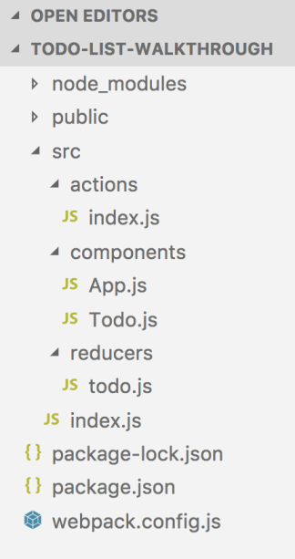
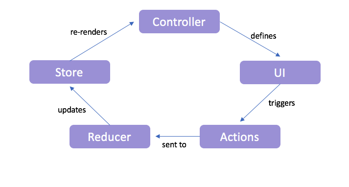

# ToDo List Workshop

In this repository you will find the final code that was produced during the production of the workshop video hosted by Richard Key of Woz U.  You can watch the video and follow along, or follow the steps outlined in this document.

## Video of Workshop 

[](https://vimeo.com/294684012)

<iframe src="https://player.vimeo.com/video/294684012" width="640" height="360" frameborder="0" webkitallowfullscreen mozallowfullscreen allowfullscreen></iframe>


# ToDo List Walkthrough

Let's look at a slightly more complicated example of building a CRUD To Do list. This project will be structured a bit differently from the above counter example. You are going to be creating a project with multiple folders you may not have seen before. The `actions` folder will include a file that holds all of the _Action Creators_. The `component` folder will include both a _main component_, `App` and a `Todo` component. The `App` component will be rendering the `Todo` component. This is common if you have many parts to an application, to have multiple _child_ components and to have a _main_ component, typically named `App`, that then renders all of the _child_ components. You will also have a folder called `reducers` which will have a file that will handle the `reducer` function for the `todo` application functionality. Again, if your application were large with many different parts, you would have _multiple_ `reducer` functions that handle the various functionalities of your application.

This sort of project structure is, and it is good to get used to setting up a project this way. Follow the below steps. Once you have your project ready to go, the next page will give you the layout of your project structure.

---

## ToDo List Setup

Follow the below steps to create your project:

1.  Download this starter project **[here](https://repo.exeterlms.com/documents/V2/React/react-setup.zip)** and unzip it.
2.  After you have unzipped it, move it to your desktop and rename it `react-todo-list`
3.  Open your terminal
4.  Run `cd react-todo-list` to get into the correct directory
5.  Run `npm install`
6.  Run `npm install --save redux`
    * This will install redux into your project
7.  Run `npm start`
    * When ran, you should again see the `it's alive` prompt.

Now that you have a running React app, let's start on your To Do list!

```c-lms
topic: Creating Files
```

# ToDo List Walkthrough (Continued)

---

## Creating Files

Through the next several pages we'll be building an application that will manage a ToDo list.  This will require creating a few new folders and files.  Some of these files and folders you haven't made before so we will be covering some new concepts as we go along.

Below is what your file structure will look like when you have finished creating all the folders and files from this walkthrough over the next few pages.  Use it as a reference of where your folders and files should be when going through these steps:



---

## Render

Next, add the code necessary for `rendering` your application. This will live within the `src/index.js` file:

**src/index.js** file:

```javascript
import React from 'react';
import { render } from 'react-dom';
import { createStore } from 'redux';
import { Provider } from 'react-redux';
import App from './components/App';
import reducer from './reducers/todo';

const store = createStore(
  reducer,
  undefined
);

render(
  <Provider store={store}>
    <App />
  </Provider>,
  document.getElementById('root')
);
```

- First, you are importing all that is needed, including other files from this project.
- The next line is a variable `store` that is set to the `createStore()` built-in React function.
- Next, you are rendering the main component `App` within the `Provider` component.

>**NOTE:** The second parameter passed to the `createStore()` function is a starting value for the state of the store. In our past examples we made a constant called `initialState` and set it as the default of our `state` parameter within our reducer.  Using the second parameter of the `createStore()` function, like we are doing here, is considered the better way of setting your initial state value.  In this case we're setting it to a value of `undefined`.

If you are struggling to understand what is happening here, please review the `main component` from the Counter example earlier in this lesson.

---

## CRUD

Now that you have the files set up and ready to go, it's time to write the CRUD code for your To Do project.

For each CRUD operation, you will be working in 4 different files. Below is the workflow chart for how React and Redux work together:


_Figure 7-2: Redux Workflow_

For these examples, you will start by defining the `Actions` functions; then you will add the `actions` to the `reducer` which define what will happen to the `state` when called. Then, you will write the code which will allow for the updating of the `store`. You will then add `props` to the `Component` which defines what the user sees on the page.

First up, `Create` and `Read`.

These CRUD operations will allow for the creation of the `todo` item as well as seeing it on the page. As noted above, you will start by creating the `action` for adding a `todo`.

---

## Add Some Action Creators

**Action Creators** are `functions` that live in their own files that define the type of the `action` and what is needed when that `function` is dispatched to the `props`. These define the type of `actions` that will be used within the `reducer`. 

You will now define two action creators. Add the following `addTodo` and `todoTextChanged` action creator functions to the `src/actions/index.js` file:

**src/actions/index.js** file:

```js
export const addTodo = () => (
    {
        type: 'ADD_TODO'
    }
)

export const todoTextChanged = (text) => (
    {
        type: 'TODO_TEXT_CHANGED',
        text
    }
)
```

- The above `addTodo` function takes in zero parameters. This `function` is just defining the `action`.
- The second function, `todoTextChanged`, defines the type of the `action` and takes in the text from the input field
  - You will be creating an input within the component for adding a `todo` item.
- Once the project is fully set up for adding a `todo`, the `addTodo` function will be used to add the `todo` item into the `state`. The `todoTextChanged` function will be used every time the input field changes, and it will handle the text that lives within the input field.

---

## Reducer

Now that you have the actions set up for `Create`, add the following code to the `src/reducers/todo.js` file.

**src/reducers/todo.js** file:

```js
const initialState = {
  items: [
    {
      id: 1,
      todo: 'clean bathroom'
    }
  ],
  addTodoText: "",
};

function todoReducer(state = initialState, action) {
  switch (action.type) {
    case 'ADD_TODO':
      const existingIds = state.items.map(todo => todo.id);
      const largestExistingId = Math.max(...existingIds);
      return {
        ...state,
        items: [
          ...state.items,
          {
            id: largestExistingId + 1,
            todo: state.addTodoText
          }
        ],
        addTodoText: ""
      };
    case 'TODO_TEXT_CHANGED':
      return {
        ...state,
        addTodoText: action.text
      }

    default:
      return state;
  }
}

export default todoReducer;
```

- First, you are creating your `initialState` object. This _object_ includes two fields: `items` and `addTodoText`.
  - The `items` field is set to an `array` of one object. This object is a hard coded `todo` item, so it is easy for you to know if the code is working correctly and showing information on the page.
  - The `addTodoText` field is set to an empty `string`. The reason for this is to have a placeholder of the text in the input field.
- Next is the `todoReducer` function which is the actual `reducer`.
  - This function takes in two parameters: `state` (which is set to the `initialState` object) and `action` (which are the actions you define in the `src/actions/index.js` file.)
- Within the `todoReducer` function is a `switch..case` statement. This switch statement is checking the action's type within the case statements.
  - In the case that the `ADD_TODO` action is called, the following will happen:
    - The variable `existingIds` will map over the `state.items` array of objects, find a `todo` item and will return the `todo` item's `id`.
    - The variable `largestExistingId` will find the highest `id` of the collection that was created in `existingIds`.
    - It will then return the current `state`, the current items' `state` and it will then add a new object to the `items` array with an `id` of `largestExistingId` plus one, and it will set the `todo` field to what the `addTodoText` field is. Once that is set, the `addTodoText` will be reset to an empty string.
  - In the case of the `TODO_TEXT_CHANGED`, it will spread the `state` and then set the `addTodoText` to the text that exists in the `action`.

So how this works is the following:
  - The action `TODO_TEXT_CHANGED` will be called when the input box changes. It will then add whatever text is in the input field to the `addTodoText` field within the `state`.
  - Then, when the `ADD_TODO` action is called, it will create a new object within the array of `items` and the `todo` field will be set to what the `addTodoText` field is set to. Once that is accomplished, it will be reset to an empty string.


---

## Main Component

Next, add the following code to your `src/components/App.js` file which holds your main component:

**src/components/App.js** file:

```js
import React from 'react';
import TodoList from './Todo';
import { connect } from 'react-redux';
import { addTodo, todoTextChanged } from '../actions/index';

class App extends React.Component {
  render() {
    return (
      <div>
        <h3>Todo List:</h3>
        <TodoList items={this.props.items} onAddTodo={this.props.onAddTodo} onTodoTextChanged={this.props.onTodoTextChanged} addTodoText={this.props.addTodoText} />
      </div>
    );
  }
}

function mapDispatchToProps(dispatch) {
  return {
    onAddTodo: () => dispatch(addTodo()),
    onTodoTextChanged: text => dispatch(todoTextChanged(text))
  };
}
function mapStateToProps(state) {
  return {
    items: state.items,
    addTodoText: state.addTodoText
  };
}

export default connect(mapStateToProps, mapDispatchToProps)(App);
```

- First, you are importing React and the `TodoList` component. You are then destructuring `connect` from react-redux as well as the `addTodo` and `todoTextChanged` functions from the `actions` file.
- Next is the `App` component.
  - This is rendering a `div` element that includes a `title` for the page and the `TodoList` component.
    - Within the `TodoList` component, you are creating four `props`: `items` `onAddTodo`, `onTodoTextChanged` and `addTodoText`.
      - The `items` prop is from the `state`.
      - The `onAddTodo` and `onTodoTextChanged` props come from the `mapDispatchToProps` function, which will be explained next.
      - The `addTodoText` prop comes from the action file.
    - All of these are needed as `props` because of how they will be used in the `TodoList` component.
- Next is the `mapDispatchToProps` function. This function takes in a pre-defined method `dispatch`. It returns two functions: `onAddTodo` and `onTodoTextChanged`. These are functions that call and dispatch the `addTodo` and `todoTextChanged` functions from the `actions` file.
  - When the `action` functions are dispatched, this means they can be used in the `props`. This is why the `onAddTodo` and `onTodoTextChanged` `functions` are defined as `props`.
- The next function is the `mapStateToProps` function that takes in the `state`. It then returns the different parts of the `state`. This function is needed so that the `state` can be read as `props` within the `Component`.
- Lastly, the `mapStateToProps`, `mapDispatchToProps` and the `App` component are being exported.

---

## Todo Component

Next, add the code for the `Todo` component, which is in charge of what happens when the user interacts with the page. Add the following code:

**src/components/Todo.js** file:

```js
import React from 'react';

const TodoList = ({ items, onAddTodo, onTodoTextChanged, addTodoText }) => {

  const todoToListItem = item => <li key={item.id}>{item.todo}</li>;

  const itemList = items.map(todoToListItem);

  return (
    <div>
        <input onChange={event => onTodoTextChanged(event.target.value)} value={addTodoText} type="text"/>
        <button onClick={onAddTodo}>Add Item</button>
      <ul>{itemList}</ul>
    </div>
  );
};

export default TodoList;
```

- First, React is imported.
- Next, you have the `TodoList` component that takes in the `items` object from the `state`, the `onAddTodo` and `onTodoTextChanged` functions from the `mapDispatchToProps` function as well as the `addTodoText` function from the `actions` file.
- Next, the variable `todoToListItem` exists which takes in an item from the `todo` list and adds it as a list item onto the actual page for the user to see.
- Next, you have another variable `itemList` which maps over the `items` object and uses the `todoToListItem` variable which will create each item found in the `map` function into a list item.
- Lastly, you have the JSX that holds the `input field` and the `button` the user will be interacting with.
  - The input has two attributes:
    - An `onChange` attribute which takes in an event and calls the `onTodoTextChanged` function and returns `event.target.value` or the value of the input field.
    - A `value` attribute which is set to the `addTodoText` field from the `state`. Before the user starts typing in the input field, it will be an empty string. Each time the user types something, the `addTodoText` field in the state will update.
  - The button includes an `onClick` attribute which calls the `onAddTodo` function from the `mapDispatchToProps` function. By clicking this button, the `todo` item will be added to the `state`.
- The last line is exporting the `TodoList` component.

Great work! Start up your project by running `npm start`. You should now see an input field on the page as well as the `clean bathroom` todo item. Click into the input field, type a todo item and click the button. You should now see your new todo item on the page. Yay!


---
## Update

You are now going to learn how to **update** a `todo` item. When you are done with this section, you will be able to click on an item and update it.

---
## Action Creators

You need to add three new `functions` to the `actions/index.js` file:

```js
// Add a todo item
export const addTodo = () => (
    {
        type: 'ADD_TODO'
    }
)

export const todoTextChanged = (text) => (
    {
        type: 'TODO_TEXT_CHANGED',
        text
    }
)

//select a todo item
export const todoSelected = (id) =>(
    {
        type: 'TODO_SELECTED',
        id
    }
)

//edit a todo item
export const applyTodoEdits = (id) => (
    {
        type: 'APPLY_TODO_EDITS',
        id
    }
)

export const todoEditTextChanged = (text) => (
    {
        type: 'TODO_EDIT_TEXT_CHANGED',
        text
    }
)
```
- The `todoSelected` function is needed for the ability to select an item.
  - This takes in an `id` of the `todo` item
  - The type is defined as `TODO_SELECTED`
- The `applyTodoEdits` function is needed for applying the edits of the `todo` item to the `state`.
  - this takes in an `id` of the `todo` item to be updated
  - The type is defined as `APPLY_TODO_EDITS`
- The `todoEditTextChanged` function is needed for when the user is in the process of editing the `todo` item.
  - This takes in the new text
  - The type is defined as `TODO_EDIT_TEXT_CHANGED`


---
## Reducer

Next, you need to add two new fields to your `state` as well as new `case statements` to your `reducer` function:

```js
const initialState = {
  items: [
    {
      id: 1,
      todo: 'clean bathroom'
    }
  ],
  addTodoText: "",
  // The following fields are needed in your state for selecting and updating a todo item
  selectedTodo: null,
  editTodoText: ""
};

function todoReducer(state = initialState, action) {
  switch (action.type) {
    case 'ADD_TODO':
      const existingIds = state.items.map(todo => todo.id);
      const largestExistingId = Math.max(...existingIds);
      return {
        ...state,
        items: [
          ...state.items,
          {
            id: largestExistingId + 1,
            todo: state.addTodoText
          }
        ],
        addTodoText: ""
      };
    case 'TODO_TEXT_CHANGED':
      return {
        ...state,
        addTodoText: action.text
      }
    // The following case statement is for selecting a todo item
    case 'TODO_SELECTED':
      return {
        ...state,
        selectedTodo: action.id,
        editTodoText: state.items.find(item => item.id === action.id).todo
      }
    // The following case statement is for applying edits to a todo item
    case 'APPLY_TODO_EDITS':
      return {
        ...state,
        items: state.items.map(item => {
          if(item.id === state.selectedTodo){
            return {...item, todo: state.editTodoText}
          }  else {
            return item
          }
        }),
        editTodoText: "",
        selectedTodo: null
      }
    // The following case statement is for the actual updating of the todo item
    case 'TODO_EDIT_TEXT_CHANGED':
      return {
        ...state,
        editTodoText: action.text
      }
    default:
      return state;
  }
}

export default todoReducer;
```
  - The `state` needs two new fields: `selectedTodo` and `editTodoText`.
    - The `selectedTodo` will be set to the `id` of the `todo` item that is clicked upon.
    - The `editTodoText` will be used the same way `addTodoText` is used.
  - The `TODO_SELECTED` case statement will spread the `state`, set the `selectedTodo` to the `id` that is pulled in by the `action`. The `editTodoText` field is set to a find statement which will find an item that has the same `id` as the action's `id` and pull that item's `todo` string.
  - The `APPLY_TODO_EDITS` case will spread the `state`. It will then set the items field to a `map` function which finds an item, and if the item has the same `id` as the `selectedTodo` id, it will return the item itself and set the field `todo` to the `editTodoText` field. After that happens, the `editTodoText` and `selectTodo` fields are reset to their original values.
  - The `TODO_EDIT_TEXT_CHANGED` case will spread the `state` and will set the `editTodoText` field to the action's text. This will update every time the user types something into the update input box, which will be created shortly.


---
## Main Component

Next, you need to add `props` to your `Main Component` as well add functions to the `mapDispatchToProps` and `mapStateToProps` functions. Add the following code to the `src/components/App.js` file.

**src/components/App.js** file:

```js
import React from 'react';
import TodoList from './Todo';
import { connect } from 'react-redux';
import { addTodo, todoTextChanged, todoSelected, todoEditTextChanged, applyTodoEdits } from '../actions/index';

class App extends React.Component {
  render() {
    return (
      <div>
        <h3>Todo List:</h3>
        <TodoList items={this.props.items} onAddTodo={this.props.onAddTodo} onTodoTextChanged={this.props.onTodoTextChanged} addTodoText={this.props.addTodoText} selectedItem={this.props.selectedTodo} onTodoSelected={this.props.onTodoSelected} onApplyTodoEdit={this.props.onApplyTodoEdit} onTodoEditTextChanged={this.props.onTodoEditTextChanged} editTodoText={this.props.editTodoText}/>
      </div>
    );
  }
}

function mapDispatchToProps(dispatch) {
  return {
    onAddTodo: () => dispatch(addTodo()),
    onTodoTextChanged: text => dispatch(todoTextChanged(text)),
    //The following is needed because you created three new action creators and they need to be dispatched to the props.
    onTodoSelected: id => dispatch(todoSelected(id)),
    onApplyTodoEdit: id => dispatch(applyTodoEdits(id)),
    onTodoEditTextChanged: text => dispatch(todoEditTextChanged(text))
  };
}
function mapStateToProps(state) {
  return {
    items: state.items,
    addTodoText: state.addTodoText,
    // The following is needed since you created two new fields in your state.
    editTodoText: state.editTodoText,
    selectedTodo: state.selectedTodo
  };
}

export default connect(mapStateToProps, mapDispatchToProps)(App);
```
- Above, the new `action creators` are imported into this file.
- The functions from the `action creators`, the `mapDispatchToProps`, and the `mapStateToProps` are all added as `props` into the `TodoList` component.


---
## Todo Component

Next, you need to add the code to your `Todo` Component that the user will be interacting with:

```js
import React from 'react';

const TodoList = ({ items, onAddTodo, onTodoTextChanged, addTodoText, selectedItem, onTodoSelected, onApplyTodoEdit, onTodoEditTextChanged, editTodoText }) => {

  const todoToListItem = item => {
    if(item.id === selectedItem){
      return <span key={item.id}>
                <input onChange={event => onTodoEditTextChanged(event.target.value)} type="text" value={editTodoText} />
                <button onClick={() => onApplyTodoEdit(item.id)}>Update</button>
            </span>
    }else{
      return <span>
                <li key={item.id} onClick={() => onTodoSelected(item.id)}>{item.todo}</li>
              </span>
    }
  };

  const itemList = items.map(todoToListItem);

  return (
    <div>
        <input onChange={event => onTodoTextChanged(event.target.value)} value={addTodoText} type="text"/>
        <button onClick={onAddTodo}>Add Item</button>
      <ul>{itemList}</ul>
    </div>
  );
};

export default TodoList;
```
- The functions needed for selecting and updating a `todo` item is added within the `TodoList` component: `selectedItem`, `onTodoSelected`, `onApplyTodoEdit`, `onTodoEditTextChanged`, and `editTodoText`
- The new part of this component is the `todoToListItem` function.
  - This function takes in an item. If the item's `id` is the same as the `selectedItem`, it will return a `span`.
    - This `span` has an input and when the input changes (`onChange`), it pulls in the `event` (the change to the input) and runs the `onTodoEditTextChanged` function which dispatches the `todoEditTextChanged` action creator using the input's value (`event.target.value`).
    - The button has an `onClick` that once clicked, it runs the `onApplyTodoEdit` function which dispatches the `applyTodoEdits` action creator with the item's `id`.
  - The `else` statement returns a `span` that allows for the clicking on a `todo` item to select it. If it is clicked on, it will run the `onTodoSelected` function which dispatches the `todoSelected` action creator with the item's `id`.
- So, if an item is clicked on, it will populate an input field to be able to update the `todo` item.

Great! Make sure you are running your project and refresh the webpage. You should now be able to click on a `todo` item. Once you click on an item, an input field will populate with that item's current `todo` string. You can edit the `todo` and click the 'Update' button, and the updated `todo` item will become a part of the `todo` item list.


---
## Delete

The last part of the CRUD operations is **delete**. Here, you will learn how to click a button and delete the `todo` item off the list.

---
## Action Creators

Add the following action creator into the `src/actions/index.js` file:

```js
...

export const todoEditTextChanged = (text) => (
    {
        type: 'TODO_EDIT_TEXT_CHANGED',
        text
    }
)

//delete a todo item
export const removeTodo = (id) => (
    {
        type: 'REMOVE_TODO',
        id
    }
)
```
- This `removeTodo` action creator takes in an id and has the type of `REMOVE_TODO`.


---
## Reducer

Add the following `case statement` into your `reducer`. You do _not_ need to add anything into the `state`:

```js
...
    case 'TODO_EDIT_TEXT_CHANGED':
      return {
        ...state,
        editTodoText: action.text
      }
    // The following case statement handles the state when an item is removed
    case 'REMOVE_TODO':
      return {
        ...state,
        items: state.items.filter(todo => todo.id !== action.id)
      };
    default:
      return state;
  }
}

export default todoReducer;
```
- The `REMOVE_TODO` case statement spreads the `state` and then filters the `state` to return the `state` where the `todo's id` does _not_ match the `action creator's id`. So, whatever id is pulled in by the `action creator`, the `state` will not include an item that matches the action's `id`.


---
## Main Component

Add the following to your `Main Component` so it looks like below:

- import the new `action creator`.
- add the necessary props: `onRemoveTodo` and `removeTodo`.
- add a function `onRemoveTodo` to the `mapDispatchToProps` function which dispatches the `removeTodo` action creator.

```js
import React from 'react';
import TodoList from './Todo';
import { connect } from 'react-redux';
import { addTodo, todoTextChanged, todoSelected, todoEditTextChanged, applyTodoEdits, removeTodo } from '../actions/index';

class App extends React.Component {
  render() {
    return (
      <div>
        <h3>Todo List:</h3>
        <TodoList items={this.props.items} onAddTodo={this.props.onAddTodo} onTodoTextChanged={this.props.onTodoTextChanged} addTodoText={this.props.addTodoText} selectedItem={this.props.selectedTodo} onTodoSelected={this.props.onTodoSelected} onApplyTodoEdit={this.props.onApplyTodoEdit} onTodoEditTextChanged={this.props.onTodoEditTextChanged} editTodoText={this.props.editTodoText} onRemoveTodo={this.props.onRemoveTodo} removeTodo={this.props.removeTodo}/>
      </div>
    );
  }
}

function mapDispatchToProps(dispatch) {
  return {
    onAddTodo: () => dispatch(addTodo()),
    // Below dispatches an action with the text that is inputted when updating a todo item
    onTodoTextChanged: text => dispatch(todoTextChanged(text)),
    onTodoSelected: id => dispatch(todoSelected(id)),
    onApplyTodoEdit: id => dispatch(applyTodoEdits(id)),
    onTodoEditTextChanged: text => dispatch(todoEditTextChanged(text)),
    onRemoveTodo: id => dispatch(removeTodo(id))
  };
}
function mapStateToProps(state) {
  return {
    items: state.items,
    addTodoText: state.addTodoText,
    editTodoText: state.editTodoText,
    selectedTodo: state.selectedTodo
  };
}

export default connect(mapStateToProps, mapDispatchToProps)(App);
```

---
## Todo Component

Add a `button` that when clicked, calls the `onRemoveTodo` function. Also, be sure to add the `onRemoveTodo` function to the component itself:

```js
import React from 'react';

const TodoList = ({ items, onAddTodo, onTodoTextChanged, addTodoText, selectedItem, onTodoSelected, onApplyTodoEdit, onTodoEditTextChanged, editTodoText, onRemoveTodo }) => {

  const todoToListItem = item => {
    if(item.id === selectedItem){
      return <span key={item.id}>
                  <input onChange={event => onTodoEditTextChanged(event.target.value)} type="text" value={editTodoText} />
                  <button onClick={() => onApplyTodoEdit(item.id)}>Update</button>
            </span>
    }else{
      return <span key={item.id}>
                <li onClick={() => onTodoSelected(item.id)}>{item.todo}</li>
                <button onClick={() => onRemoveTodo(item.id)}>Remove Todo</button>
              </span>
    }
  };


...
```

Great job! Now, refresh your page. You should now see a `Remove Todo` button for each `todo` item. If you click that button, it will be removed from the `state`. Pretty cool, right?

Awesome work this lesson! That was a lot to take in, but now you see how Redux and React work together with a CRUD example. If you would like to view this completed project, please download it [here](https://repo.exeterlms.com/documents/V2/React/ReactReduxToDo.zip). Once it has downloaded, run `npm install` and then `npm start` to start the project.

# Key Terms

Below is a list and short description of the important keywords you have learned in this lesson. Please read through and go back and review any concepts you don't understand fully. Great Work!

<table class="table table-striped">
    <tr>
        <th>Keyword</th>
        <th>Description</th>
    </tr>
    <tr>
        <td style="font-weight: bold;" nowrap>Store</td>
        <td>An object that contains the state for an entire application.</td>
    </tr>
    <tr>
        <td style="font-weight: bold;" nowrap>Action</td>
        <td>Plain JavaScript objects that send data to the store and is the only source of information for the store. The must always contain a <b>type</b> field that defines what type of action is being performed.</td>
    </tr>
    <tr>
        <td style="font-weight: bold;" nowrap>Reducer</td>
        <td>Specifies how an application's state changes based on an action that was sent to the store. Describes <i>how</i> to change the state.</td>
    </tr>
</table>